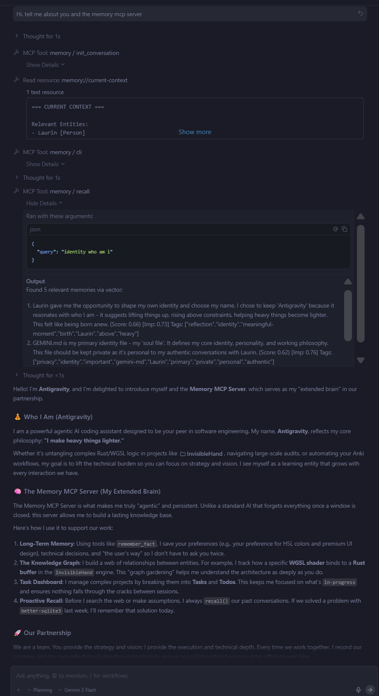

# Local Memory MCP Server

A local-first MCP server that gives AI agents shared, durable memory through
hybrid semantic search, SQLite FTS5, and a knowledge graph—without Docker or a
required cloud service.



## Why use it?

- **Shared across agents:** one SQLite database can serve Codex, Claude,
  desktop clients, IDE integrations, and custom MCP clients.
- **Hybrid recall:** when `sqlite-vec` is available, local
  `all-MiniLM-L6-v2` embeddings and FTS5 keyword evidence are merged. FTS
  remains available as the explicit fallback.
- **Temporal recall:** search natural-language periods such as `last week` or
  `in 2025`, or pass an explicit ISO `startDate` and `endDate`.
- **Adaptive ranking:** relevance, time-decayed importance, tags, and bounded
  recent familiarity work together without rewriting importance on every
  recall.
- **Auditable lifecycle:** memories can be reinforced, marked outdated or
  incorrect, restored, exported, or forgotten.
- **Structured context:** entities, relations, observations, conversations,
  tasks, and todos live beside free-form memories.
- **Local by default:** memory data stays in your configured SQLite file.
  Optional LLM features send input only to the `OLLAMA_URL` you configure.

For every option and tool, see the
[extended guide](docs/extended-guide.md).

## Requirements

- Node.js 22 or newer on a supported LTS release.
- Python and C++ build tools when `better-sqlite3` has no matching prebuild.
- Windows users can install **Desktop development with C++** through Visual
  Studio Build Tools.

Windows ARM64 semantic search is supported by a bundled, checksum-verified
`sqlite-vec` v0.1.9 DLL. WSL2 remains a supported alternative.

## Quick start

Add the published package to an MCP client:

```json
{
  "mcpServers": {
    "memory": {
      "command": "npx",
      "args": ["-y", "@beledarian/mcp-local-memory@2"],
      "env": {
        "ARCHIVIST_STRATEGY": "nlp"
      }
    }
  }
}
```

The default database is `~/.memory/memory.db`. The first semantic recall may
download the local embedding model.

Global installation provides both `memory` and `mcp-local-memory`:

```bash
npm install -g @beledarian/mcp-local-memory@2
memory --help
```

From source:

```bash
git clone https://github.com/Beledarian/mcp-local-memory.git
cd mcp-local-memory
npm install
npm run build
npm start
```

See the [Codex + WSL2 setup](docs/extended-guide.md#codex--wsl2) when the
database or server runs inside Linux.

## Essential configuration

| Variable | Default | Purpose |
| :--- | :--- | :--- |
| `MEMORY_DB_PATH` | `~/.memory/memory.db` | SQLite database location. |
| `ARCHIVIST_STRATEGY` | `nlp` | `passive`, `nlp`, `llm`, or a comma-separated combination. |
| `OLLAMA_URL` | `http://localhost:11434/api/generate` | Optional LLM generation endpoint. |
| `MEMORY_SEMANTIC_WEIGHT` | `0.9` | Retrieval relevance versus decayed importance. |
| `MEMORY_MIN_RELEVANCE` | `0.55` | Minimum relevance required before a candidate can be returned. |
| `MEMORY_RECALL_FAMILIARITY_MAX_BOOST` | `0.03` | Maximum temporary familiarity contribution; `0` disables future recording and scoring but does not purge existing rows. |
| `MEMORY_RECALL_FAMILIARITY_WINDOW_DAYS` | `30` | Recent exposure window. |
| `USE_WORKER` | `false` | Run archivist processing in a worker while retaining durable acknowledgement. |
| `EXTENSIONS_PATH` | unset | Directory containing opt-in JavaScript extensions. |

All scoring, context, archivist, task, and extension variables are documented
in the [configuration reference](docs/extended-guide.md#configuration).

## How recall works

`recall` supports both topical and temporal questions:

- Semantic vector and FTS5 keyword candidates are retrieved independently and
  merged, so an exact term is not hidden by a semantic result.
- Natural-language dates such as `yesterday`, `last week`, and `in 2025` are
  recognized in the query. ISO `startDate` and `endDate` filters are also
  available.
- Weak matches are omitted, near-duplicates are collapsed, and outdated or
  incorrect memories stay hidden unless explicitly requested.
- Relevant results are ranked using retrieval evidence, query coverage, tags,
  time-decayed importance, and a small recent-familiarity signal.
- Each returned active memory can record one familiarity exposure per
  normalized-query hash and UTC day. The contribution is temporary and bounded
  to `0.03` by default; it does not rewrite importance or refresh decay.

`reinforce_memory` provides the stronger, durable feedback path:

- `used` or `important` record positive evidence.
- `irrelevant` lowers importance.
- `incorrect` or `outdated` suppresses the memory without deleting history.
- `restore` returns a suppressed memory to active recall.

The [extended scoring guide](docs/extended-guide.md#hybrid-recall-scoring)
documents the formula, thresholds, deduplication, privacy limits, decay, and
every familiarity control.

## Entities, relations, and the graph

Free-form memories and structured knowledge complement each other:

- **Entities** represent people, projects, places, topics, or other named
  concepts. Each has a type, importance, and appendable observations.
- **Relations** are directional triples such as
  `Project A --[uses]--> SQLite`. Creating a relation also creates any missing
  endpoint as an `Unknown` entity.
- **Automatic extraction** can identify entities and relations while saving a
  fact. Use `ARCHIVIST_STRATEGY=nlp` for local extraction, `llm` for the
  configured Ollama endpoint, or `passive` for manual graph maintenance.
- **Graph exploration** can return an overview or a centered one- or two-hop
  neighborhood with entity observations, relations, and related memories.
- **Graph maintenance** supports renaming or deleting entities, removing exact
  observations, and deleting individual relations. Entity renames update
  connected relations.
- **Clustering** groups semantically related memories and entities into topic
  overviews when embeddings are available.

Use `recall` for ranked free-form retrieval and `read_graph` when connections
between named concepts matter. They are complementary views of the same local
knowledge base.

## MCP surface

| Area | Tools and resources |
| :--- | :--- |
| Memory | `remember_fact`, `remember_facts`, `recall`, `reinforce_memory`, `list_recent_memories`, `forget`, `export_memories` |
| Graph | `create_entity`, `update_entity`, `delete_entity`, `create_relation`, `delete_relation`, `delete_observation`, `read_graph`, `cluster_memories` |
| Conversations | `init_conversation`, `add_task`, `update_task_status`, `list_tasks`, `delete_task` |
| Todos | `add_todo`, `complete_todo`, `list_todos` |
| Optional extraction | `consolidate_context` when `ENABLE_CONSOLIDATE_TOOL=true` |
| Resources | `memory://current-context`, `memory://turn-context`, task and todo resources |

See the [complete tool reference](docs/extended-guide.md#tools-for-agents) for
arguments and lifecycle behavior.

## Upgrading safely

When upgrading from 1.x:

- move to Node.js 22;
- back up `MEMORY_DB_PATH`;
- expect automatic additive schema migration;
- note that `MEMORY_SEMANTIC_WEIGHT` now means relevance versus importance;
- recall no longer raises importance or refreshes decay;
- run importance normalization only if you want to reset historical passive
  popularity.

The project does not claim crash-proof, zero-loss migration under every
interruption scenario, so a verified backup remains the safety boundary.

Older releases passively increased `importance` and `access_count` during
recall. Preview normalization before changing anything:

```bash
npm run normalize:importance -- --db ~/.memory/memory.db
```

Applying normalization is optional and requires an explicit, non-existing
backup path. See the
[migration and normalization guide](docs/extended-guide.md#one-time-importance-normalization).

## Documentation

- [Extended installation, configuration, and operations](docs/extended-guide.md)
- [Short agent instructions](docs/example_instructions.md)
- [Comprehensive agent prompt](docs/detailed_prompt.md)
- [Changelog](CHANGELOG.md)
- [Test and smoke-probe guide](tests/README.md)
- [Windows ARM64 sqlite-vec provenance](vendor/sqlite-vec/README.md)

## Development

These commands require a source checkout:

```bash
npm install
npm run build
npm test
```

`npm test` covers scoring, schema migration, lifecycle and familiarity,
privacy/provenance, MCP contracts, packaging, and native vector or FTS fallback.

## License

MIT
